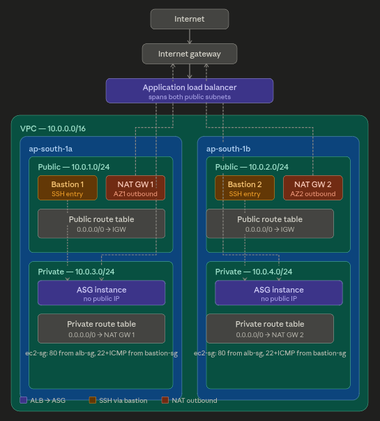
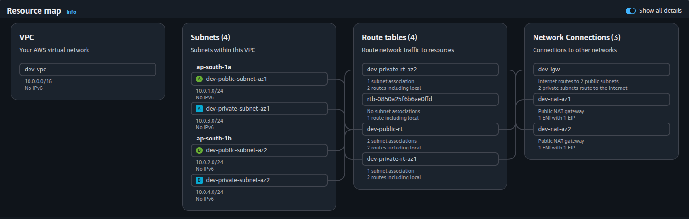
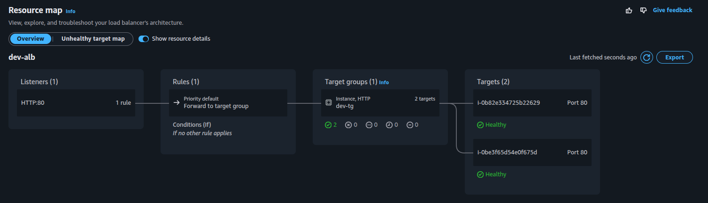
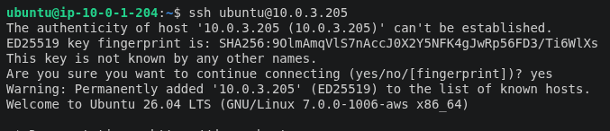

# Terraform AWS Architecture

This repository provisions a small, production-style AWS application stack with Terraform.
It is organized as reusable modules and a `dev` environment that wires them together.

## High-Level Architecture

The architecture contains:

- One VPC with DNS support enabled
- Two public subnets across two Availability Zones
- Two private subnets across the same two Availability Zones
- An internet-facing Application Load Balancer in the public subnets
- An Auto Scaling Group of private EC2 instances running Nginx
- Bastion hosts in the public subnets for secure SSH access to private instances
- Two NAT Gateways, one in each public subnet, for private subnet outbound access

## Traffic Flow

### Application traffic

1. Users open the ALB DNS name from the browser.
2. The request reaches the internet-facing ALB in the public subnets.
3. The ALB forwards traffic to the target group.
4. The target group sends the request to private EC2 instances in the Auto Scaling Group.
5. Each instance serves a simple Nginx page generated by user data.

### SSH access to private instances

1. A user first connects to a bastion host in a public subnet.
2. The bastion host is reachable only from the allowed SSH CIDR.
3. From the bastion host, the user can SSH into the private EC2 instances.
4. Direct SSH from the internet to private instances is not allowed.

### Outbound access from private subnets

1. Private instances do not receive public IP addresses.
2. Their default route points to a NAT Gateway in the same Availability Zone.
3. The VPC module provisions one NAT Gateway in each public subnet, backed by an Elastic IP.
4. This allows package installation and other outbound internet access without exposing the instances publicly.

## Module Breakdown

- `modules/vpc` creates the VPC, subnets, internet gateway, NAT gateways, and route tables.
- `modules/security_group` creates the ALB, bastion, and EC2 security groups.
- `modules/bastion` creates one bastion host in each public subnet.
- `modules/alb` creates the application load balancer, target group, and listener.
- `modules/asg` creates the launch template and Auto Scaling Group for private application servers.

## Network Design

The `dev` environment uses the following CIDR plan:

- VPC: `10.0.0.0/16`
- Public subnet AZ1: `10.0.1.0/24`
- Public subnet AZ2: `10.0.2.0/24`
- Private subnet AZ1: `10.0.3.0/24`
- Private subnet AZ2: `10.0.4.0/24`

The VPC has:

- One internet gateway for public access
- One route table for public subnets with a default route to the internet gateway
- One private route table per Availability Zone with a default route to the local NAT Gateway

## Security Model

- ALB security group allows inbound HTTP and HTTPS from `0.0.0.0/0`.
- Bastion security group allows SSH and ICMP only from `allowed_ssh_cidr`.
- EC2 security group allows HTTP only from the ALB security group.
- EC2 security group allows SSH and ICMP only from the bastion security group.

This keeps the application tier private while still allowing controlled administration.

## Compute Layer

The Auto Scaling Group launches private EC2 instances using a launch template.
User data installs Nginx and writes a simple response page that shows the instance private IP.
This makes it easy to confirm load balancing and instance-level routing through the ALB.

## Terraform State

The environment uses an S3 backend for remote state:

- Bucket: `cloudops-terraform-state-nidhi`
- Key: `dev/terraform.tfstate`
- Region: `ap-south-1`

## Required Inputs

Update `environments/dev/terraform.tfvars` with values for:

- `allowed_ssh_cidr`
- `ami_id`
- `key_name`
- Any CIDR or region values you want to customize

## Deploy

From the `environments/dev` directory:

```bash
terraform init
terraform plan
terraform apply
```

## Expected Outputs

After a successful apply, Terraform outputs:

- VPC ID
- Bastion public IPs
- ALB DNS name
- Auto Scaling Group name

Use the ALB DNS name to test the application in a browser.
Use the bastion public IPs to SSH into the public entry point and reach private instances.

## AWS Console Evidence

Add your screenshots here after uploading them to the repository.

### 1. Architecture diagram



### 2. VPC resource flow



### 3. ALB resource flow



### 4. Server routing through ALB


### 5. Private instance with bastion host



## Suggested Screenshot Checklist

- VPC summary page showing the VPC, subnets, route tables, internet gateway, and NAT gateways
- ALB page showing the listener, target group, and healthy targets
- EC2 instances page showing the bastion host and private ASG instances
- Browser test showing the ALB DNS name serving the Nginx page
- SSH session from bastion to a private instance

## Notes

- Private instances do not have public IPs.
- Bastion hosts are the only direct SSH entry point.
- The ALB is the only public entry point for application traffic.
- The deployment is split into reusable modules so the same pattern can be reused in other environments.